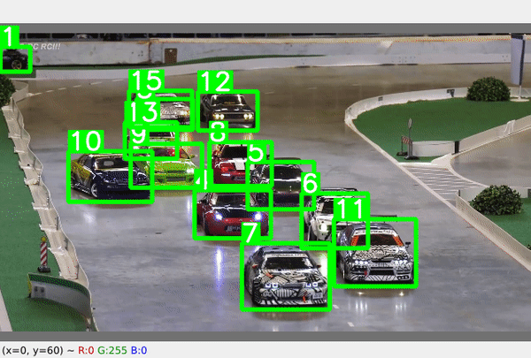

# <div align="center">Simple Object Tracking</div>

<div align="center">
<p>Object tracker, count, path with yolov7 and ByteTrack</p>
<p>
<!--    -->
</p>
</div>

## Requirements

* torch >= 1.10.1
* torchvision >= 0.11.1

Other requirements can be installed with `pip install -r requirements.txt`.

Clone the repository recursively:

```bash
$ git clone --recursive git@github.com:1chimaruGin/SimpleTracker.git
```

Then download a YOLO model's weight from [YOLOv7](https://github.com/WongKinYiu/yolov7) and place it in `weights`.

## Tracking

You can change the class you want to track.
Check the class id [here](https://tech.amikelive.com/node-718/what-object-categories-labels-are-in-coco-dataset/).
```bash
$ python tracker.py --source /path/to/video --model weights/yolov5m6.pt --classes 0
```

## References

* https://github.com/WongKinYiu/yolov7
* https://github.com/ifzhang/ByteTrack
## Citations

``` 
@article{zhang2022bytetrack,
  title={ByteTrack: Multi-Object Tracking by Associating Every Detection Box},
  author={Zhang, Yifu and Sun, Peize and Jiang, Yi and Yu, Dongdong and Weng, Fucheng and Yuan, Zehuan and Luo, Ping and Liu, Wenyu and Wang, Xinggang},
  booktitle={Proceedings of the European Conference on Computer Vision (ECCV)},
  year={2022}
}
```